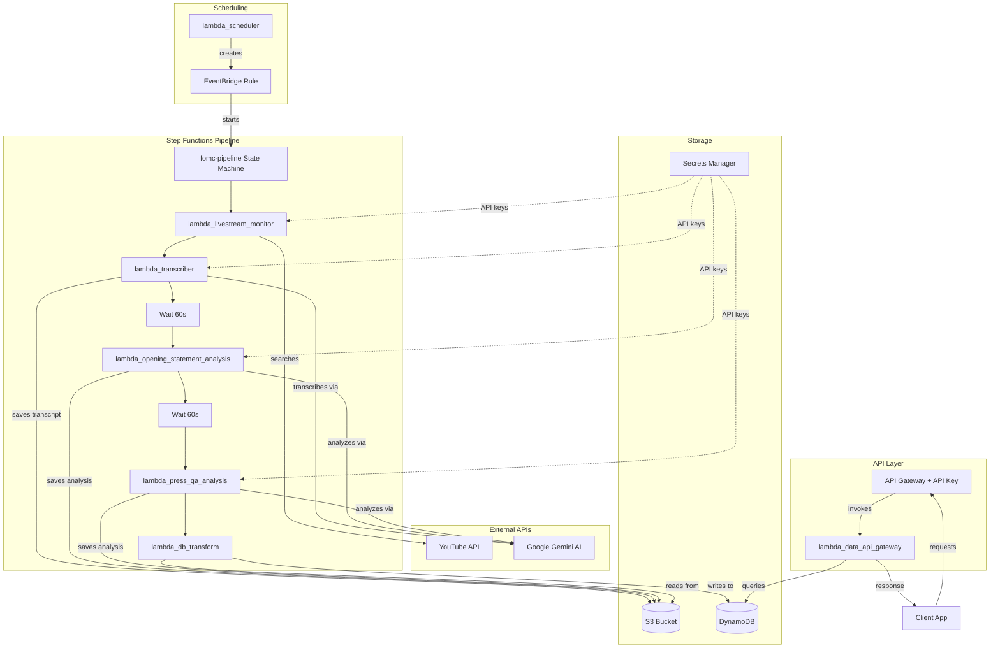

# FOMC Debriefs AWS Deployment

This directory contains all the necessary files to deploy the FOMC Debriefs infrastructure to AWS using CloudFormation.

## Architecture Overview

The deployment creates the following AWS resources:

- **DynamoDB Table**: `fomc-gists-dynamodb` - Stores processed FOMC meeting data
- **S3 Bucket**: `fomc-gists-s3-{account-id}` - Stores raw files and Lambda layers
- **Step Functions**: `fomc-pipeline` - Orchestrates the processing pipeline with retries
- **API Gateway**: REST API with API key authentication and 4 endpoints for data access
- **Lambda Functions**: 7 functions for different processing stages
- **Secrets Manager**: Securely stores API keys (`fomc-gists/env-keys`)
- **IAM Roles**: Proper permissions for all services

### Architecture Diagram



## Prerequisites

1. **AWS CLI** configured with appropriate credentials
2. **Environment file** (`.env`) in the parent directory with required API keys
3. **Lambda Layer** (`layer.zip`) in the parent directory containing Python dependencies

### Setting Up API Keys

1. Copy the example environment file to the parent directory:
   ```bash
   cp .env.example ../.env
   ```

2. Edit `../.env` and fill in your API keys:
   ```
   # YouTube Data API v3 Key
   # Get one at: https://console.cloud.google.com/apis/credentials
   YOUTUBE_API_KEY=your_youtube_api_key_here

   # Google AI Studio API Key (for Gemini)
   # Get one at: https://aistudio.google.com/app/apikey
   GOOGLE_AI_API_KEY=your_google_ai_api_key_here

   # Federal Reserve YouTube Channel ID (default provided)
   FED_CHANNEL_ID=UCAzhpt9DmG6PnHXjmJTvRGQ
   ```

3. The deployment script will:
   - Read these keys from the `.env` file
   - Pass them securely to CloudFormation as parameters
   - Store them in AWS Secrets Manager as `fomc-gists/env-keys`
   - Lambda functions retrieve keys from Secrets Manager at runtime

## Deployment Instructions

### Option 1: Using Bash Script (Linux/macOS/WSL)

```bash
cd aws
chmod +x deploy.sh
./deploy.sh
```

### Option 2: Using PowerShell Script (Windows)

```powershell
cd aws
Set-ExecutionPolicy -ExecutionPolicy RemoteSigned -Scope CurrentUser
.\deploy.ps1
```

### Option 3: Manual CloudFormation

```bash
# Load environment variables from .env file
export $(grep -E "^(YOUTUBE_API_KEY|GOOGLE_AI_API_KEY|FED_CHANNEL_ID)=" ../.env | xargs)

# Deploy the stack
aws cloudformation deploy \
    --template-file cloudformation-template.yaml \
    --stack-name fomc-gists-stack \
    --parameter-overrides \
        YoutubeApiKey="$YOUTUBE_API_KEY" \
        GoogleAiApiKey="$GOOGLE_AI_API_KEY" \
        FedChannelId="${FED_CHANNEL_ID:-UCAzhpt9DmG6PnHXjmJTvRGQ}" \
    --capabilities CAPABILITY_IAM \
    --region us-east-1

# Upload required files manually
BUCKET_NAME=$(aws cloudformation describe-stacks \
    --stack-name fomc-gists-stack \
    --query 'Stacks[0].Outputs[?OutputKey==`S3BucketName`].OutputValue' \
    --output text)

aws s3 cp ../layer.zip s3://$BUCKET_NAME/layers/layer.zip

# Update Lambda function codes (repeat for each function)
aws lambda update-function-code \
    --function-name fomc-data-api-gateway \
    --zip-file fileb://lambda_data_api_gateway.zip
```

## API Endpoints

After deployment, the API Gateway will provide these endpoints. All endpoints require an API key (`x-api-key` header).

1. **GET /meetings/years** - Returns all available years
2. **GET /meetings/{year}** - Returns all meeting dates for a specific year
3. **GET /meetings/{year}/{month-date}** - Returns full meeting data
4. **GET /meetings/{year}/{month-date}/opening_statement_transcript** - Returns just the opening statement

Example API URL: `https://abcdefghij.execute-api.us-east-1.amazonaws.com/prod`

To retrieve your API key value after deployment:
```bash
aws apigateway get-api-key --api-key <API_KEY_ID> --include-value --query 'value' --output text
```

## Environment Variables

The deployment automatically configures these environment variables for Lambda functions:

- `YOUTUBE_API_KEY` - For livestream monitoring
- `GOOGLE_AI_API_KEY` - For AI analysis
- `FED_CHANNEL_ID` - YouTube channel to monitor
- `S3_BUCKET` - S3 bucket name
- `DYNAMODB_TABLE` - DynamoDB table name
- `STATE_MACHINE_ARN` - Step Functions state machine ARN (scheduler only)
- `EVENTBRIDGE_SF_ROLE_ARN` - IAM role for EventBridge to start Step Functions (scheduler only)

## File Structure

```
aws/
├── cloudformation-template.yaml  # Infrastructure as Code
├── deploy.sh                     # Bash deployment script
├── undeploy.sh                   # Cleanup script
├── .env.example                  # Example environment file (copy to ../.env)
├── lambda_data_api_gateway.py    # API Gateway integration Lambda
├── lambda_livestream_monitor.py  # YouTube monitoring Lambda
├── lambda_transcriber.py         # Transcription processing
├── lambda_opening_statement_analysis.py # Opening statement analysis
├── lambda_press_qa_analysis.py   # Press Q&A analysis
├── lambda_db_transform.py        # Combines S3 data into DynamoDB record
├── lambda_scheduler.py           # FOMC meeting scheduler
└── README.md                     # This file
```

## Pipeline Workflow

The pipeline is orchestrated by AWS Step Functions with per-step retries:

1. **Livestream Monitor** - Polls YouTube for completed FOMC press conference (retries 3x at 10.5 min intervals)
2. **Transcriber** - Transcribes video via Gemini AI and saves to S3
3. **Wait 60s** - Gemini API rate limit buffer
4. **Opening Statement Analysis** - Analyzes the Chair's opening statement via Gemini AI
5. **Wait 60s** - Gemini API rate limit buffer
6. **Press Q&A Analysis** - Analyzes press conference Q&A via Gemini AI
7. **Transform & Load** - Reads all S3 artifacts and writes combined record to DynamoDB
8. **API Gateway** - Serves processed data to applications (independent of pipeline)

If any step fails after exhausting retries, the pipeline transitions to a `PipelineFailed` state.

## Cleanup

To remove all AWS resources:

```bash
# Using the cleanup script
./undeploy.sh

# Or manually
aws cloudformation delete-stack --stack-name fomc-gists-stack
```

Note: S3 bucket and DynamoDB table have `DeletionPolicy: Retain` and will not be deleted with the stack.

## Costs

Expected monthly costs (with minimal usage):

- **DynamoDB**: ~$1-5 (pay per request)
- **Lambda**: ~$1-10 (generous free tier)
- **S3**: ~$1-5 (storage and requests)
- **API Gateway**: ~$1-5 (per million requests)
- **Step Functions**: ~$0.01 (per execution, ~8 state transitions each)

**Total estimated**: $5-25/month depending on usage

## Troubleshooting

### Common Issues

1. **Layer.zip not found**: Ensure `layer.zip` exists in the parent directory
2. **API Keys**: Make sure your YouTube and Google AI API keys are valid
3. **Permissions**: Ensure your AWS credentials have sufficient permissions
4. **Region**: The default region is `us-east-1`, modify scripts if needed

### Logs

Check CloudWatch Logs for each Lambda function:
- `/aws/lambda/fomc-livestream-monitor`
- `/aws/lambda/fomc-transcriber`
- `/aws/lambda/fomc-opening-statement-analysis`
- `/aws/lambda/fomc-press-qa-analysis`
- `/aws/lambda/fomc-db-transform`
- `/aws/lambda/fomc-data-api-gateway`

Step Functions execution history:
- AWS Console > Step Functions > `fomc-pipeline` > Executions

## Security

- API keys are stored in AWS Secrets Manager (`fomc-gists/env-keys`)
- Lambda functions retrieve secrets at runtime (not stored in environment variables)
- S3 bucket has public access blocked
- IAM roles follow least privilege principle
- API Gateway endpoints require an API key
- CORS restricted to `https://fomcdebriefs.netlify.app`
- All communications use HTTPS

## Support

For issues with deployment:
1. Check CloudFormation events in AWS Console
2. Review Lambda function logs in CloudWatch
3. Check Step Functions execution history for pipeline failures
4. Verify all prerequisites are met
5. Ensure proper AWS permissions
